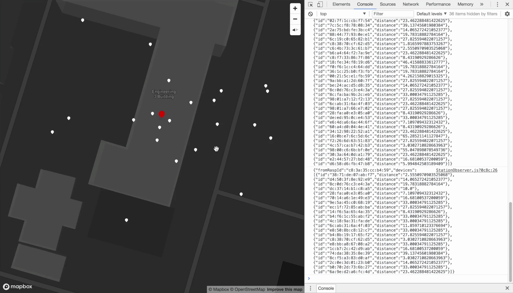

# Wireless Anomaly Detection System (WADS)

> A team project&#39;s repository as part of 2110481 Wireless Computer Networks course 2017/1

## Table of Contents
- [Developing](#developing)
- [React Boilerplate's Documentation](#react-boilerplates-documentation)
- [License](#license)

## Developing
### Prerequisites
- [Yarn](https://yarnpkg.com/en/docs/install) `v1.3.2` or higher
- [Node](https://nodejs.org/en/download/) `v8.0.0` or higher

### Quick start
1. Duplicate `.env.example` as `.env`
2. Paste your Mapbox Access API Token in `.env` file  
   *Note that you can get your Mapbox Access API Token at https://www.mapbox.com/studio/account/tokens/*
3. Run `yarn` to install dependencies
4. Run `yarn start`, at this point you can view the web app at `localhost:3000`

## React Boilerplate's Documentation
- [**The Hitchhikers Guide to `react-boilerplate`**](docs/general/introduction.md): An introduction for newcomers to this boilerplate.
- [Overview](docs/general): A short overview of the included tools
- [**Commands**](docs/general/commands.md): Getting the most out of this boilerplate
- [Testing](docs/testing): How to work with the built-in test harness
- [Styling](docs/css): How to work with the CSS tooling
- [Your app](docs/js): Supercharging your app with Routing, Redux, simple
  asynchronicity helpers, etc.
- [**Troubleshooting**](docs/general/gotchas.md): Solutions to common problems faced by developers.

## License
This project is licensed under the MIT license, Copyright (c) 2017. For more information see `LICENSE.md`.